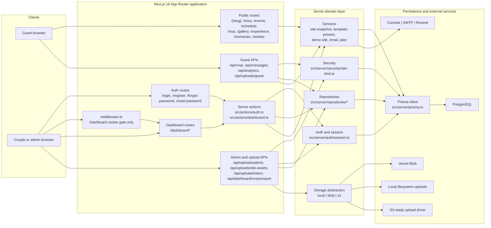
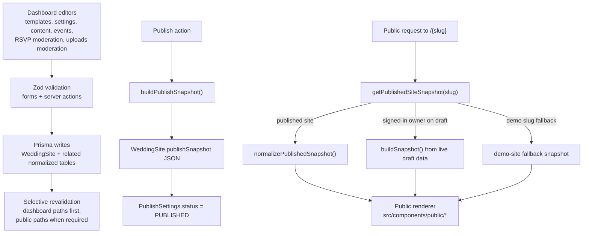
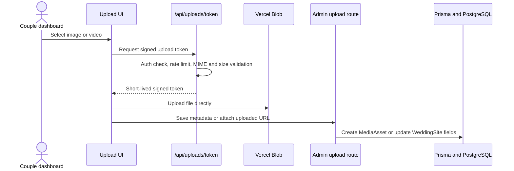

# Implemented Architecture

This document describes the architecture that is currently implemented in the repository. It is an as-built view of the system, not a target-state roadmap.

Stakeholder-ready visual exports:

- `docs/architecture-stakeholder.svg`
- `output/architecture-stakeholder.png`

## System overview

## Request and content lifecycle

## Upload flow

## Implemented responsibilities by layer

| Layer | What it currently owns |
| --- | --- |
| `src/app` | App Router pages, layouts, route-level metadata, API routes, dashboard shells |
| `src/components` | Public site renderer, dashboard forms, builders, upload widgets, auth UI |
| `src/actions` | Auth flows, dashboard save/update flows, publish/unpublish, moderation |
| `src/server/auth` | JWT cookie session parsing, current-user lookup, route guards |
| `src/server/repositories` | Prisma-backed read models for dashboard pages and public lookups |
| `src/server/services` | Snapshot building, template preset seeding, demo fallbacks, email helpers |
| `src/server/security` | Database-backed rate limiting |
| `src/server/storage` | Storage-driver abstraction across local, Blob, and S3-ready adapters |
| `prisma/schema.prisma` | Core relational data model for users, couples, sites, content, RSVPs, uploads, messages, and analytics |

## Key implementation notes

- Authentication is intentionally split:
  - `middleware.ts` only checks whether the auth cookie exists for `/dashboard/*`
  - real verification happens server-side in `src/server/auth/session.ts`
  - this keeps the edge bundle smaller and avoids pulling Prisma into middleware

- Public rendering is snapshot-driven:
  - published sites prefer `WeddingSite.publishSnapshot`
  - unpublished sites can still render for the signed-in owner as a draft preview
  - the demo slug has a seeded fallback so the marketing demo still works even if the database is unavailable

- Dashboard data loading is page-specific:
  - repository functions such as `getWorkspaceShellForUser`, `getContentEditorSiteForUser`, `getTemplateSettingsForUser`, and `getSettingsSiteForUser` avoid loading the entire site graph on every page

- Uploads are environment-aware:
  - local development can use local storage
  - production can use Vercel Blob with signed uploads
  - the storage layer is abstracted so S3 can be wired in without changing dashboard or API callers

- Guest writes are protected:
  - RSVP, message, and upload endpoints use Zod validation plus database-backed rate limiting before persistence

## Primary runtime dependencies

- Next.js App Router for UI, routing, layouts, metadata, and API routes
- Prisma with PostgreSQL for persistence
- `jose` for signed JWT cookies
- `bcryptjs` for password hashing
- `react-hook-form` plus `zod` for form validation
- Vercel Blob client uploads when `STORAGE_DRIVER=blob`
